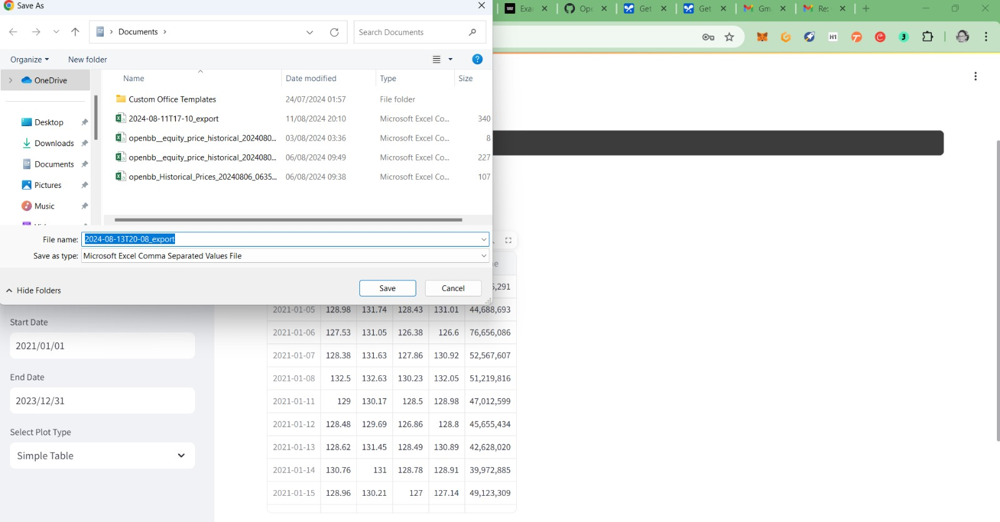

---

# Infomark Web App Documentation

## Overview

The **Infomark Web App** is a sophisticated financial platform designed for educational purposes and data analysis. It provides a seamless experience for users to explore financial data, query useful financial information, and visualize trends across various financial sectors for their statistical, business education, and/or financial education needs.

It has been developed for the Strathmore University DBIT IS Project 1, under student name: Celestine Kariuki , of student number: 116533.


## Features

### 1. User Authentication

- **Login & Registration**: Secure login and registration with profile management.
- **Password Management**: Secure password resetting and updating.

### 2. Financial Data Analysis


- **Search & Explore**: Search for ticker symbols and explore various types of financial data.


- **Data Visualization**: Display data through line graphs and tables.
- **Provider Selection**: Access data from multiple financial data providers through an Openbb interface integration


- **Export To Excel**: Export Real-Time Data to Microsoft Excel

## Technical Specifications

### Backend

- **Database**: Uses SQLite3 to cache data in a local filesystem and YAML files for efficient data storage over the browser.
- **Authentication**: Passwords are hashed and managed using streamlit-authenticator for security.
- **User Management**: Functions for creating, updating, and retrieving user information.

### Frontend

- **Streamlit**: Built with Streamlit for an interactive and user-friendly interface.
- **Responsive Design**: Adapts to various screen sizes for a consistent user experience.

### API Integration

The Infomark Web App integrates with several APIs to fetch and display financial data:

- **Alpha Vantage**: Provides real-time and historical market data.
- **Benzinga**: Offers financial news and analysis.
- **OpenBB Platform Libraries**: Facilitates access to a wide range of financial and economic data.
- **Financial Modeling Prep (FMP)**: Supplies comprehensive financial data and metrics.
- **Intrinio**: Delivers financial data feeds and analytics.
- **Federal Reserve Bank of New York API**: Provides macroeconomic data from the Federal Reserve.
- **Yahoo Finance**: Historical and real-time market data.
- **BizToc**: Financial news aggregation.
- **CBOE**: Options market data.
- **ECB**: European Central Bank data.
- **EconDB**: Economic data.
- **FINRA**: Financial regulatory data.
- **FinViz**: Stock market data.
- **FMP**: Financial modeling prep data.
- **FRED**: Federal Reserve Economic Data.
- **World Bank**: Global economic data.
- **GDELT**: Global event data.
- **IEEE**: Financial research data.
- **Inflation API**: Inflation data.
- **NASDAQ**: Stock market data.

### Data Storage and Management

- **Database**: Uses SQLite3 for caching of data retrieved from APIs in the terminal, ensuring lightweight and reliable database management.
- **YAML Files**: Configuration and user preferences are managed using YAML files instead of cookies for improved security and organization.
- **OpenBB Cloud Hub**: Hosts API connections, endpoints and ensures robust data integration and management. It's like a gateway for APIs, ensuring easy management and input of credentials by the Admin.

## Setup and Installation

### Prerequisites

- Python 3.7 or higher
- Streamlit
- SQLAlchemy
- SQLite3
- Streamlit-authenticator
- Additional libraries for API integrations
- Pip for Python Management

### Installation

1. **Clone the Repository**

   ```bash
   git clone <repository_url>
   cd <repository_directory>
   ```

2. **Install Dependencies**

   ```bash
   pip install -r requirements.txt
   ```

3. **Configure API Keys**

   Set up your API keys and/or Personal Access Tokens(PAT) in a YAML configuration file (`config.py`) for secure access.

4. **Run the Application**

   ```bash
   streamlit run main.py
   ```

## Running the Application

To start the Infomark Web App, execute the following command in your terminal:

```bash
streamlit run main.py
```

This command launches the Streamlit server and opens the web app in your default browser.

## Security Considerations

- **API Key Management**: Ensure API keys are stored securely and managed through YAML files.
- **User Data**: Protect user data with strong encryption and secure authentication methods.

## Future Enhancements

- **AI-Powered Insights**: Integrate AI to provide predictive analytics and personalized financial recommendations.
- **Enhanced Data Visualization**: Add advanced charting tools and interactive visualizations.
- **User Feedback System**: Implement a feedback mechanism to continuously improve the app based on user input.
- **Interactive Tutorials**: Add guided tutorials to help users understand financial concepts and use the app effectively.
- **Customizable Dashboards**: Allow users to personalize their dashboards with widgets and data sources of their choice.
- **Real-Time Notifications**: Implement real-time notifications for important market events and updates.

## Contact

For support or inquiries, please contact:

- **Email**: celestine.kariuki@strathmore.edu

---
